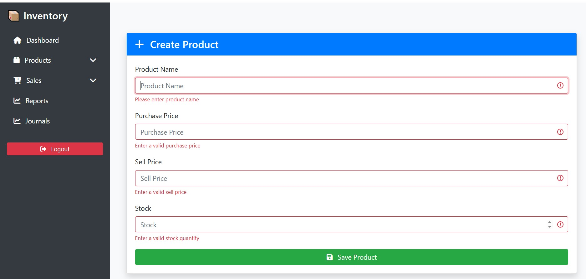
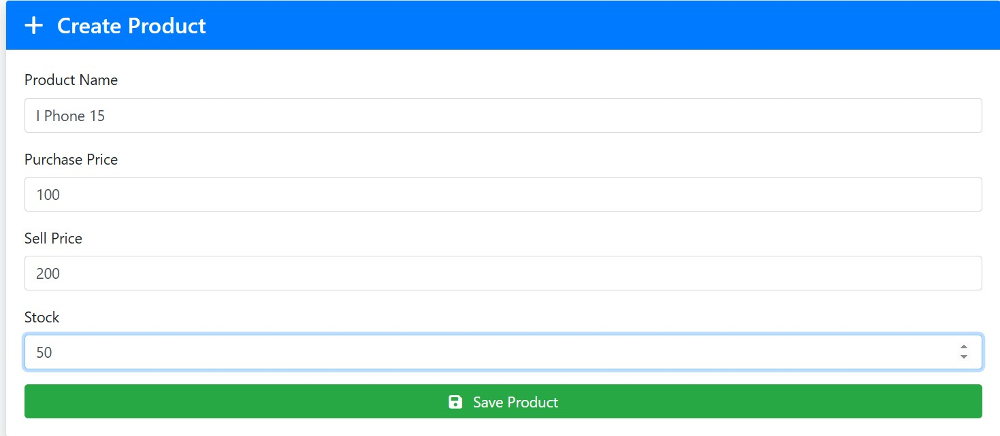
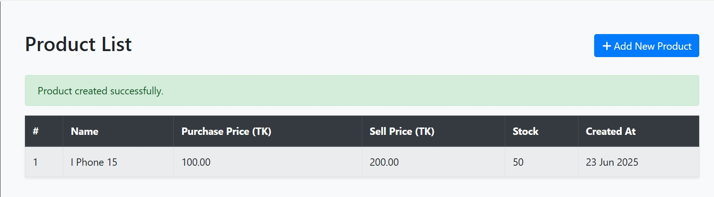
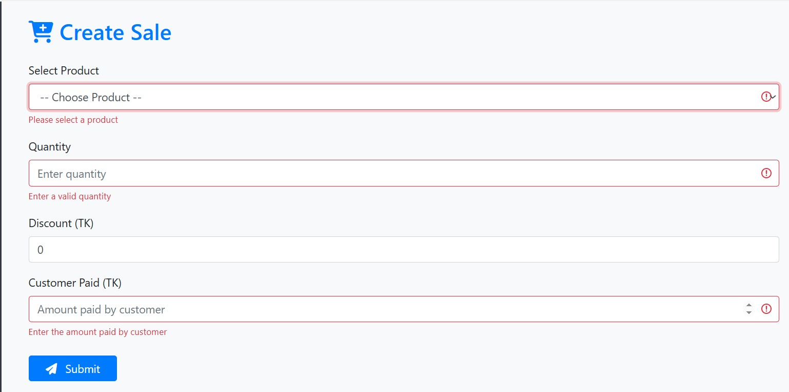
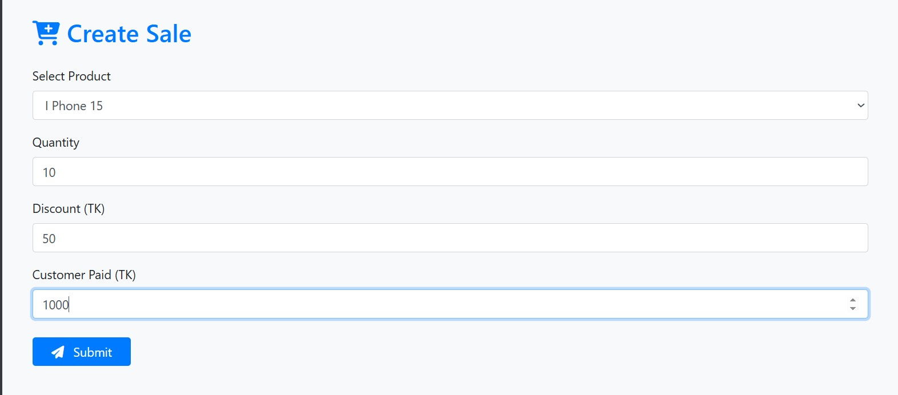
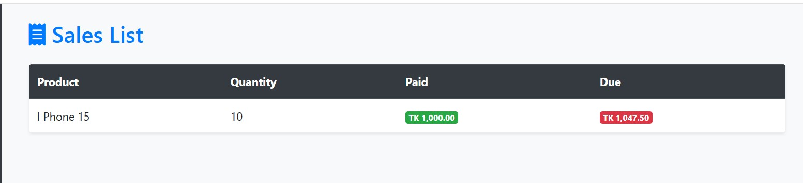
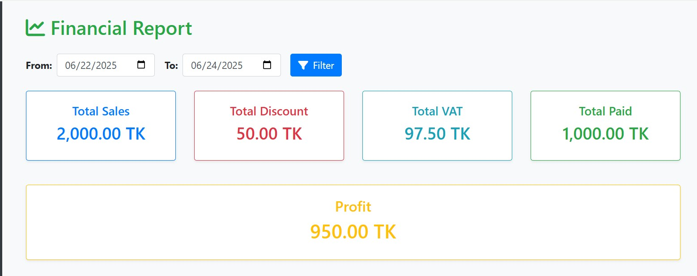
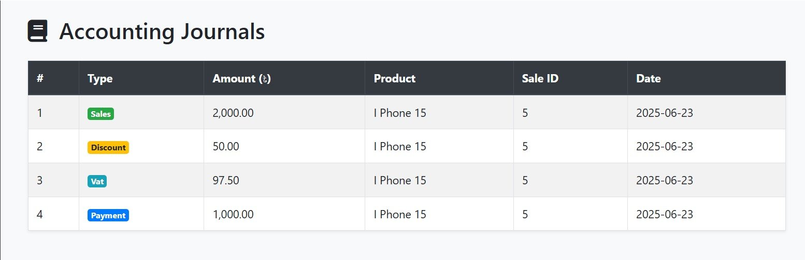

📦 Inventory & Financial Reporting System

A simple inventory and accounting system built with Laravel. This application allows users to manage product stock, perform sales with discounts and VAT, maintain accounting journals, and generate financial reports filtered by date.
✅ Features
🛒 Inventory Module

    Product creation and listing

    Tracks purchase price, sell price, and opening stock

    Stock is automatically updated upon sale

💰 Sales Module

    Record sales with:

        Quantity sold

        Discount entry

        5% VAT auto-calculated (on total after discount)

        Customer payment & remaining due (auto-calculated)

    Automatically deducts sold quantity from product stock

📘 Accounting Journal

    Each sale automatically generates entries for:

        Sales

        Discount

        VAT

        Payment (cash/due)

    View journal entries (optional UI page)

📊 Financial Reporting

    View reports with a date filter:

        Total Sales

        Total Discount

        Total VAT

        Total Paid

        Optional: Profit = (Total Paid - (Purchase Price × Sold Quantity))

🧾 Sample Data Used

    Product: Purchase Price = 100 TK, Sell Price = 200 TK, Stock = 50 units

    Sale Example: 10 units, 50 TK discount, 5% VAT, 1000 TK paid → due auto-calculated

🔐 Auth

    Laravel Breeze used for authentication scaffolding

    Access to product, sales, and reports is restricted to authenticated users

🎨 UI Features

    Clean Bootstrap-based design

    Sidebar menu with collapsible submenus

    Blade + jQuery validation for forms

    Pagination for product & sales list

⚙️ Tech Stack

    Laravel 10+

    MySQL

    Laravel Breeze (auth)

    Bootstrap 4.5 + FontAwesome

    jQuery (for validation)

